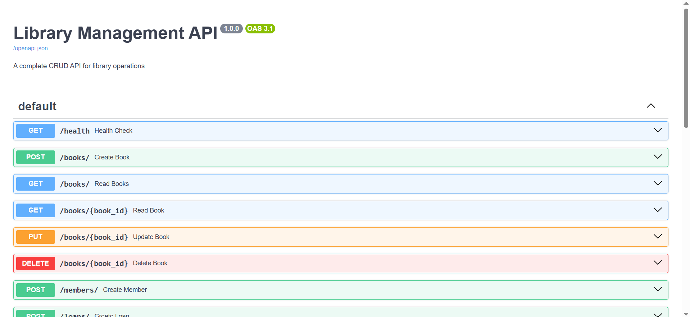

# Library Management System

## Question 1: Database Management System
The SQL file creates a complete library management database with:
- Books, Authors, Members, and Loans tables
- Proper relationships and constraints
- Sample data for testing

## Question 2: CRUD API

### Features
- Full CRUD operations for Books, Members, and Loans
- Proper error handling and validation
- Database connection management
- RESTful endpoints

### Setup

1. **Database Setup**
   ```
   mysql -u root -p < sql/library_management.sql

2. **Install Dependencies**
     pip install -r requirements.txt

3. **Run the API**

    python -m uvicorn app.main:app --reload

4. **API Testing Guide**

Interactive Documentation
Access these built-in tools:

Swagger UI: http://localhost:8000/docs

-Swagger Preview

ReDoc: http://localhost:8000/redoc

5. **Test Endpoints**
-Books

http
POST /books/
Content-Type: application/json

{
  "isbn": "978-0140449266",
  "title": "Crime and Punishment",
  "publication_year": 1866,
  "genre": "Classic",
  "total_copies": 3,
  "available_copies": 3
}

-Members

http
POST /members/
Content-Type: application/json

{
  "first_name": "Jane",
  "last_name": "Smith",
  "email": "jane.smith@example.com"
}

-Loans

http
POST /loans/
Content-Type: application/json

{
  "book_id": 1,
  "member_id": 1
}

-Expected Responses
Endpoint	Success Response	Error Case
POST /books/	201 Created	400 if ISBN exists
GET /books/1	200 OK	404 if not found
POST /loans/	201 Created	400 if no copies available


6. **Sample Test Data**

-- Sample book for testing
INSERT INTO books (isbn, title, publication_year, genre) 
VALUES ('978-0061120084', 'To Kill a Mockingbird', 1960, 'Fiction');

-- Sample member
INSERT INTO members (first_name, last_name, email)
VALUES ('Test', 'User', 'test@example.com');